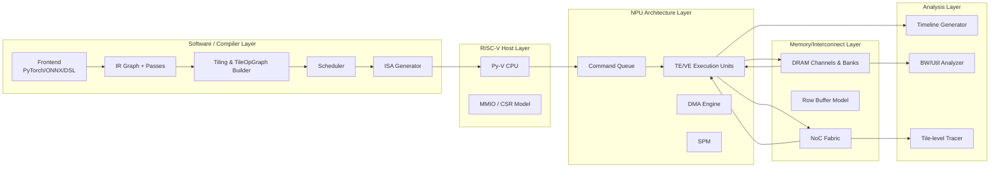
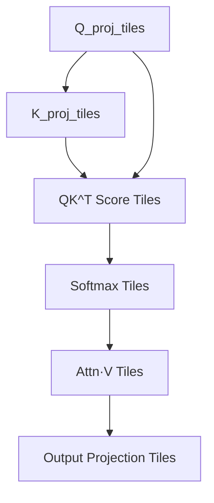

# Architecture Overview — IA_RISC_V_NPU_Simulator v2  
**Full Technical Overview (Ultra‑Long, Expanded Edition)**  
Version: 1.1  
Status: Complete  
<!-- status: complete -->
Author: IA_RISC_V_NPU_Simulator Team  

---

# 0. Purpose of This Document

이 문서는 **IA_RISC_V_NPU_Simulator v2**의 전체 아키텍처를  
아주 상세하고 구체적으로 설명하는 “풀버전(Full Version)” 아키텍처 개요 문서이다.

본 시뮬레이터는 AI 컴파일러–NPU 백엔드–RISC‑V Host–Memory/NoC–Profiler까지  
완전한 End‑to‑End 파이프라인을 시뮬레이션하는 **연구/산업용 고정밀 NPU Simulator**이며,  
이 문서의 목적은 다음이다:

- 전체 시스템 구조를 한눈에 이해  
- 각 모듈 간 데이터/제어 흐름 정의  
- 타일 기반 아키텍처가 어떻게 IR/ISA/Timeline까지 영향을 주는지 명확히 설명  
- LLaMA Attention을 중심으로 현대 LLM workload modeling을 위한 구조적 근거 제공  

---

# 1. High-Level Architecture

아래 그림은 IA_RISC_V_NPU_Simulator v2의 전체 구조를 나타낸다.

```mermaid
flowchart TD
    A[PyTorch / ONNX / DSL] --> B[Frontend Normalizer]
    B --> C[IR Graph Representation]
    C --> D[Tiling Engine<br/>Tile Generation]
    D --> E[TileOpGraph<br/>Dependency Analysis]
    E --> F[Scheduler<br/>(Static & Dynamic)]
    F --> G[xNPU ISA Generator<br/>Per-Core Stream Builder]
    G --> H[RISC-V Py-V Host<br/>Submit/Wait]
    H --> I[NPU Command Queue]
    I --> J[NPU Runtime<br/>TE/VE/DMA/SPM Cores]
    J --> K[DRAM Controller<br/>Bank/Row Model]
    K --> L[NoC Fabric<br/>Packet Routing]
    K --> J
    J --> M[Profiler<br/>Timeline/BW/Utilization]
```

---

# 2. Layered Architecture

아키텍처를 레이어 단위로 다시 나타내면 다음과 같다.



---

# 3. Dataflow Description (IR → Tile → ISA → Execution)

## 3.1 IR Graph Formation  
Frontend(FX/ONNX/DSL)는 IRNode 기반의 연산 그래프를 생성한다.

예시 IRNode 종류:
- MatMul  
- Conv2D  
- Softmax  
- LayerNorm  
- KVStore / KVLoad  
- Add / Mul / Reshape / Transpose  
- AttentionQKV / AttentionScore  

---

## 3.2 Tiling Engine  
IRNode를 TileDesc 단위로 분해한다.

### 타일 정보:
```
TileDesc:
    tensor_id
    offset
    shape
    dram_base
    dram_size
    spm_required
```

### 타일링의 목표:
- SPM에 적합한 sub-tensor block으로 분할  
- DRAM burst alignment 만족  
- TileOpGraph로 연결 가능한 최소 단위  
- 각 tile이 ISA로 lowering 가능한 수행 단위  

---

## 3.3 TileOpGraph  
TileOpNode 기반의 DAG를 구성한다.

예: Attention 단일 step DAG:



---

## 3.4 Scheduler  
Two-phase scheduling:

### 1) Static Scheduling
- Topological sort  
- Critical-path 계산  
- Core coarse assignment  

### 2) Dynamic Scheduling
- 실시간 DRAM/NoC busy 상태 반영  
- tile-level execution dispatch  
- resource-aware scheduling  

Dynamic Scheduler는 실제 timeline 생성의 핵심.

---

## 3.5 ISA Generation  
각 TileOpNode → ISA sequence:

- DMA_LOAD / DMA_STORE  
- TE_MATMUL_TILE  
- VE_OP_TILE  
- KV_STORE_TILE  
- KV_LOAD_TILE  
- SYNC  

ISA 스트림은 per-core로 생성된다.

---

## 3.6 RISC‑V Py‑V Host  
RISC-V CPU는 다음 역할 수행:
- NPU job descriptor 생성  
- command queue에 스트림 주소 저장  
- doorbell 레지스터 트리거  
- completion queue polling  

---

## 3.7 NPU Runtime  
NPU는 여러 개의 core로 구성:

```
NPU Core:
    - Cmd Fetch/Decode
    - TE (Tensor Engine)
    - VE (Vector Engine)
    - DMA Engine
    - SPM
```

### NPU Tick Loop:
```
fetch → decode → TE/VE/DMA update → SPM update
```

---

## 3.8 Memory/Interconnect  
### DRAM Model:
- channels  
- banks  
- row-buffer  
- per-bank queue  
- FR-FCFS arbitration  

### NoC Model:
- Packet injection  
- hop-based latency  
- link bandwidth 제한  
- contention simulation  

---

## 3.9 Profiler  
Simulator의 최종 출력.

기록 항목:
- TE/VE timeline  
- DMA timeline  
- DRAM/NoC bandwidth  
- KV-store / load stall  
- tile-level latency breakdown  

---

# 4. Key Architectural Principles

### ✔ Principle 1: Tile-Centric Execution  
모든 실행 단위는 타일이며:
- ISA는 tile granularity  
- scheduler는 tile-level  
- timeline도 tile-level  

---

### ✔ Principle 2: Memory is the Bottleneck  
LLM에서는 **KV-load가 전체 latency 대부분**을 차지한다.

이를 위해 다음을 cycle-level로 모델링:
- DRAM bank conflict  
- NoC congestion  
- DMA queue stall  
- R/W switching  

---

### ✔ Principle 3: End-to-End Consistency  
타일 → ISA → timeline 과정에서 정보 손실이 없어야 한다.

---

# 5. Architecture of Each Subsystem

## 5.1 Frontend  
- FX tracer / ONNX parser  
- Canonicalization  
- Fusion (QKV, FFN 등)  
- IRGraph with shape inferred  

---

## 5.2 IR  
연산 간 producer/consumer 의존성을 유지하여:
- tile slicing 시 dependency graph 보존  
- scheduler가 stable order 생성  

---

## 5.3 Tiler  
타일링은 다음 요소를 고려:
- SPM 용량  
- DRAM burst alignment  
- TE array shape  
- multi-head attention parallelism  
- KV-store / KV-load layout  

---

## 5.4 TileOpGraph  
DAG invariant:
- No cycle  
- tile dependency 정확  
- memory op ordering 보장  

---

## 5.5 Scheduler  
Static Scheduler → Dynamic Scheduler 파이프라인.

Dynamic scheduler’s core:
- resource-aware  
- memory-first dispatch  
- multi-core balance  
- tile-level decision  

---

## 5.6 ISA  
ISA는 tile연산을 TE/VE/DMA 명령으로 인코딩.

KV 확장 ISA:
- KV_STORE_TILE  
- KV_LOAD_TILE  

---

## 5.7 NPU Runtime  
core-level 업데이트:
```
issue → execute → complete → retire
```

---

## 5.8 DRAM & NoC  
KV-heavy workload를 위한 최적화된 모델:

- per-bank queue  
- row-buffer hit/miss 모델  
- hop-based NoC latency  
- DRAM/NoC utilization timeline  

---

# 6. LLaMA Attention End-to-End Flow (Detailed)

### Step 1. Q/K/V Projections  
MatMul tiling → tile DAG → ISA → TE 실행.

### Step 2. KV-store  
새로운 K_t, V_t DRAM 저장.

### Step 3. KV-load  
모든 `[0..t]` 구간 DRAM load (다수의 burst 요청).

### Step 4. QKᵀ Scores  
Q tile × K tile → TE matmul sequences.

### Step 5. Softmax  
VE 통합.

### Step 6. Attn·V  
memory-heavy + compute-heavy 연산.

### Step 7. Output Projection  
MatMul 후 final output.

### Step 8. Timeline  
KV-load stalls가 latency의 대다수.

---

# 7. Extensibility Roadmap

지원 예정:

- FlashAttention tiling engine  
- grouped-query attention(GQA)  
- multi-chip NoC modeling  
- MLIR frontend  
- power/perf estimation  

---

# 8. Summary

본 아키텍처는:

- AI compiler와 NPU backend를 긴밀히 결합  
- 타일을 기반으로 한 compute/memory 통합 모델  
- DRAM/NoC 병목을 정확히 드러내는 timeline  
- LLM attention workload 기반으로 심층 분석 가능  

을 목표로 하는 **현대적인 NPU 시뮬레이터 아키텍처**이다.

---

# End of Document
