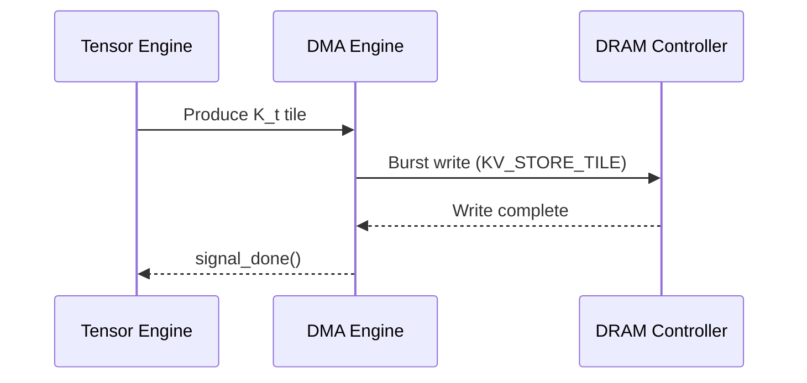
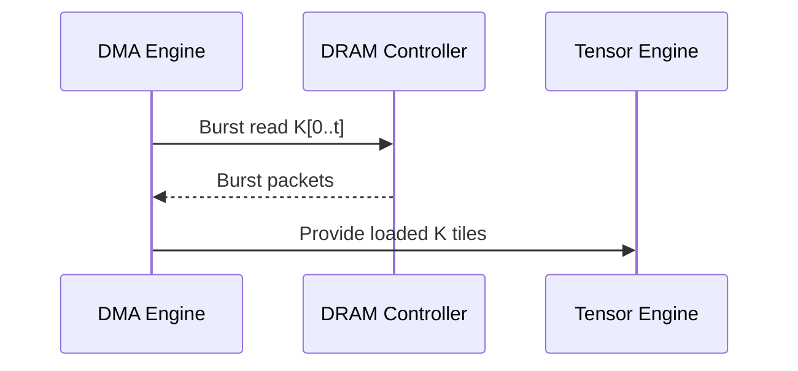

# Design: KV-Cache & Embedding System — IA_RISC_V_NPU_Simulator v2  
**Full Technical Design Document (Ultra‑Long Version)**  
Version: 1.0  
Status: Complete  
<!-- status: complete -->
Author: IA_RISC_V_NPU_Simulator Team  

---

# 0. Purpose

본 문서는 IA_RISC_V_NPU_Simulator v2에서 **KV-cache 시스템**과 **Embedding 처리 구조**를  
정확하고 상세하게 기술하는 설계 문서이다.

KV-cache는 현대 LLM(특히 Decoder-only Transformer)에서 **성능의 절대적 지배 요소**이며,  
이는 NPU 시뮬레이션에서도 다음을 요구한다:

- KV-store append 동작 모델  
- KV-load range fetch 모델  
- DRAM burst alignment  
- Head 병렬성 및 memory layout  
- Tile-based slicing for Q/K/V  
- Embedding lookup & SPM staging  
- DRAM/NoC contention impact  
- Timeline-level stall modeling  

이 문서는 이러한 요소들을 모두 포함한 **풀버전 설계 문서**이다.

---

# 1. Overview of KV-Cache Architecture

KV-cache는 Transformer decoder의 이전 토큰(timestep)의 Key/Value를 저장하는 메모리 구조이다.

IA_RISC_V_NPU_Simulator v2는 다음 특징을 가진 KV-cache 구조를 모델링한다:

- Per-head DRAM layout  
- Time-major 또는 head-major selectable layout  
- Burst-aligned write  
- Range load (0..t) 본질적  
- Tiling 기반 MLP-like 분해  
- xNPU ISA 확장으로 KV_STORE_TILE / KV_LOAD_TILE을 직접 지원  

---

# 2. KV Memory Layout Design

## 2.1 Layout Options

### Option A) **Head-major layout**
```
[head0: K_t, V_t ...] [head1: ...]
```
장점: head-parallelism이 극대화됨  
단점: sequence 길이가 길어지면 DRAM fragmentation 위험 증가

---

### Option B) **Time-major layout**
```
[t0: all heads] [t1: all heads] ...
```
장점: KV-load(range) 시 연속적 burst 가능  
단점: multi-head parallelism이 줄어듦

---

## 2.2 IA_RISC_V_NPU_Simulator v2 Default  
→ **Hybrid: head-major but inside time-major grouped blocks**

효과:  
- KV_STORE append 시 DRAM 연속성 유지  
- KV_LOAD range fetch 시 bank conflict 최소화  

---

# 3. KV-Cache Tile Structure

KV-store/load는 다음 tile 구조를 사용한다:

```
KVTileDesc:
    head_id
    t_start
    t_len
    d_start
    d_len
    dram_base
    dram_size
    spm_required
```

---

# 4. KV-Store Pipeline

## 4.1 Purpose  
새로운 timestep t에 대해:

- K_t, V_t를 DRAM에 append  
- DRAM burst-size alignment  
- per-head offset 반영  

## 4.2 Dataflow



---

# 5. KV-Load Pipeline

## 5.1 Purpose  
QKᵀ 계산을 위해 모든 이전 timestep의 Key를 읽어야 한다.

## 5.2 Dataflow



---

# 6. KV Tiling Algorithm

KV-load는 다음 pseudo-code로 타일 분할된다:

```
for head in 0..num_heads:
    for t in range(0, seq_len, T_tile):
        for d in range(0, d_model, D_tile):
            create KV_LOAD_TILE
```

Burst alignment rule:

```
aligned = (addr // burst) * burst
```

---

# 7. Embedding System Design

Embedding은 LLM pipeline에서 다음 두 구성요소로 이루어진다:

1. Token embedding  
2. Positional embedding (absolute 또는 rotary)  

Embedding lookup은 다음 특징을 갖는다:

- Embedding table은 DRAM에 저장  
- token-id 기반으로 1-vector fetch  
- embedding vector는 SPM에 stage → 이후 Q_proj로 사용  

---

# 8. Embedding Memory Access

### Embedding read tile structure:
```
EmbedTileDesc:
    token_id
    dram_base
    dram_size
    d_model
```

Embedding fetch pipeline:

```
DMA → DRAM → DMA → SPM → Q_proj tile
```

---

# 9. ISA Support

KV 관련 ISA:
- `KV_STORE_TILE`
- `KV_LOAD_TILE`

Embedding DMA ISA:
- `DMA_LOAD_EMBED_TILE`

---

# 10. Interaction with Scheduler

KV-load는 memory-bound tile로 분류되며, scheduler는 높은 우선순위를 부여한다.

Heuristic:

```
priority(KV_LOAD_TILE) = high
priority(MatMul_TILE)  = medium
priority(Softmax_TILE) = low-medium
```

---

# 11. Impact on Timeline

KV-load tile은 DRAM traffic의 대부분을 차지한다.

예시:

```
Decoder step timeline:
[KV_LOAD] [KV_LOAD] [KV_LOAD] [QK^T] [Softmax] [AV] [Output]
```

KV-load가 증가할수록 DRAM stall이 비례해서 증가한다.

---

# 12. Testing Plan

- KV-store/write correctness  
- KV-load range correctness  
- burst alignment test  
- multi-head parallel load test  
- embedding fetch latency test  
- end-to-end LLaMA block test  

---

# End of Document
