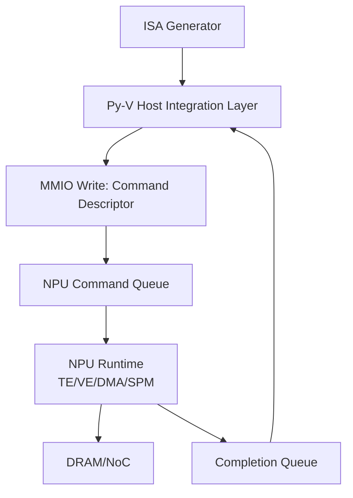

# Design: Py-V Integration — IA_RISC_V_NPU_Simulator v2  
**Full Technical Design Document (Ultra‑Long Version)**  
Version: 1.0  
Status: Complete  
Author: IA_RISC_V_NPU_Simulator Team  

---

# 0. Purpose

본 문서는 IA_RISC_V_NPU_Simulator v2에서 **Py‑V (Python-based RISC‑V Simulator)** 와  
xNPU 시뮬레이터가 어떻게 상호 연동되는지 명확한 기술적 설계를 제공한다.

Py‑V는 다음 역할을 수행하는 **호스트 CPU 시뮬레이터**이다:

- xNPU ISA 스트림 제출  
- MMIO/CSR 기반 NPU 장치 제어  
- 명령어 기반 메모리 액세스 모델 구현  
- Completion queue polling  
- Interrupt/doorbell 시뮬레이션  
- Host-side scheduling(비동기 NPU job 관리)

즉, Py‑V는 단순한 시뮬레이터가 아니라  
**Compiler → Host → NPU → DRAM/NoC 전체 파이프라인의 연결점**이다.

---

# 1. Integration Overview

전체 연동 구조는 아래와 같다.



Py‑V는 다음 요소를 시뮬레이션한다:

- RISC‑V Pipeline (simplified)  
- CSR/Memory subsystem  
- MMIO region for xNPU device  
- NPU job submission semantics  
- Host memory model  
- Host↔NPU synchronization  

---

# 2. Py‑V Responsibilities in the System

## 2.1 NPU Job Submission
Py-V는 생성된 ISA 스트림을 NPU에게 다음 형식으로 전달한다:

1. ISA stream을 host memory에 저장  
2. Descriptor 생성:  
```
{
    stream_addr: ptr,
    stream_len: bytes,
    npu_core_mask: core_bitmap,
    completion_flag_ptr: host_mem_ptr
}
```
3. Descriptor를 MMIO 레지스터에 기록  
4. Doorbell CSR write로 NPU 시작 트리거  

---

## 2.2 MMIO/CSR Emulation

Py‑V는 다음 주소 공간을 갖는다:

```
0x8000_0000 – 0x8000_FFFF : Host DRAM space (emulated)
0x9000_0000 – 0x9000_0FFF : NPU MMIO registers
```

CSR 예:
- `NPU_DOORBELL`
- `NPU_STREAM_DESC_ADDR`
- `NPU_COMPLETION_ADDR`

---

## 2.3 Host Memory Model

Host DRAM은 간단한 바이트 배열이다:

```
host_mem = bytearray(HOST_DRAM_SIZE)
```

ISA stream, descriptor table, completion flag가 이 공간에 존재한다.

---

## 2.4 Command Queue Interaction

NPU는 다음 방식으로 command queue를 poll한다:

```
fetch descriptor from MMIO
read ISA stream from host memory
execute ISA
write completion flag
```

Py‑V는 이 과정을 cycle-wise로 진행한다.

---

# 3. Py‑V Instruction Set Extensions

Py‑V RISC‑V 모델은 다음 pseudo-instructions를 지원한다:

### 3.1 `XNPU_SUBMIT stream_ptr, completion_ptr`
- NPU_DOORBELL CSR write  
- Descriptor write  

### 3.2 `XNPU_WAIT completion_ptr`
- completion_ptr이 1이 될 때까지 polling  

---

# 4. Host–NPU Synchronization Model

## 4.1 Doorbell Mechanism

Py‑V writes:

```
CSRs[NPU_DOORBELL] = 1
```

NPU runtime에서 doorbell 감지 후:

```
read descriptor
start execution
```

---

## 4.2 Completion Queue

NPU가 작업을 마치면:

```
host_mem[completion_ptr] = 1
```

Py‑V는 이를 polling 또는 interrupt 방식으로 감지한다.

---

## 4.3 Optional Interrupt Design

향후 확장:

- Py‑V → NPU interrupt controller  
- `XNPU_WAIT`를 block sleep으로 변경  

---

# 5. Integration with ISA Generator

ISA Generator는 Py-V와 직접 연결되어 있지 않으나,  
다음 파일을 Py‑V가 인식하는 방식으로 저장한다:

```
stream_0.bin
stream_1.bin
...
descriptor_0.json
```

Host-side integration layer가 이를 불러와 다음 작업을 수행한다:

1. stream → host_mem write  
2. descriptor → host_mem write  
3. doorbell trigger  

---

# 6. Py-V Runtime Tick Model

Py‑V는 cycle-based 실행 모델을 갖는다.

```
while not done:
    execute one RISC-V instruction
    check MMIO writes
    if doorbell: launch NPU execution
    npu_core.tick()
    dram.tick()
    noc.tick()
    profiler.tick()
```

---

# 7. Py‑V ↔ NPU Memory Mapping

## 7.1 Shared Memory Space

host_mem과 npu_spm은 별도의 메모리이다.

전송은 DMA로 이루어진다:

```
host_mem → NoC → DRAM → SPM
```

Py-V는 주소 변환만 관리한다.

---

## 7.2 DRAM Segmentation

Host DRAM과 NPU DRAM은 동일 DRAM space로 모델링되나,
구역은 논리적으로 나뉜다:

```
[0x0000_0000 ... 0x0FFF_FFFF] Host general memory
[0x1000_0000 ... 0x1FFF_FFFF] NPU KV-cache
[0x2000_0000 ... 0x2FFF_FFFF] IR/Weight static region
```

---

# 8. Py‑V Implementation Components

Directory structure:

```
src/pyv/
    riscv_core.py
    mmio.py
    csr.py
    host_memory.py
    device_interface.py
    npu_launch.py
    integration_api.py
```

---

# 9. Integration API Specification

The API for scheduler/frontends:

```
from pyv.integration_api import submit_stream

submit_stream(
    isa_stream,          # bytearray
    npu_core_mask,       # e.g. 0b1111
    completion_token_id  # int
)
```

Py‑V 내부에서:

- host_mem write  
- descriptor write  
- doorbell trigger  
- return completion_token  

---

# 10. Example Flow (End-to-End)

```python
isa = isa_gen.lower(tile_schedule)
token = submit_stream(isa, core_mask=0xF)

wait_for_completion(token)
```

Timeline:

```
Py-V      : write descriptor → doorbell
NPU       : fetch → execute → DMA → DRAM → VE/TE → complete
Host      : detect completion → return to user
```

---

# 11. Testing Plan

- MMIO correctness  
- descriptor consistency  
- Py-V ↔ NPU synchronization  
- multi-core stream submission  
- DRAM data correctness  
- performance scaling  
- Py-V instruction set test suite  

---

# End of Document
